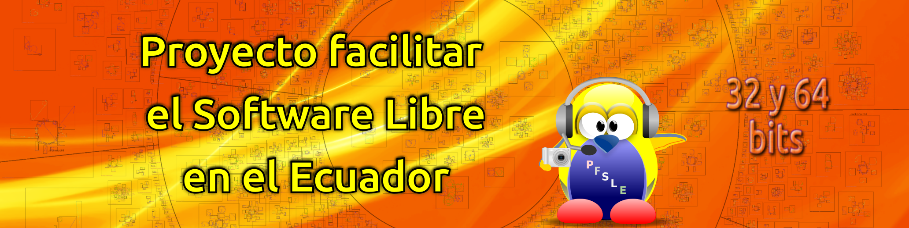

# 👋 Hi, I'm Washington Indacochea Delgado

### Welcome to my GitHub account / Bienvenidos a mi cuenta en GitHub

---

## About Me / Sobre Mí

I'm a **32-bit Linux user** passionate about compiling and improving applications that are no longer available for legacy systems. I love documenting everything that helps me along the way.

Soy un **usuario de Linux de 32 bits** apasionado por compilar y mejorar aplicaciones que ya no están disponibles para sistemas legacy. Me encanta documentar todo lo que me va sirviendo en el camino.

> 🐧 *"Linux, the final frontier"* - Washington Indacochea Delgado

---

## Technologies & Skills / Tecnologías y Habilidades

---

## Featured Projects / Proyectos Destacados

### Music & Worship Apps / Aplicaciones de Música y Adoración

| Repository | Description |
| ---------- | ----------- |
| [Cancionero](https://github.com/wachin/Cancionero) | Christian Praise Songbook of the Church     Cantorale de Alabanza Cristiana de la Iglesia |
| [guitarchordstudio](https://github.com/wachin/guitarchordstudio) | Guitar Chord Studio - Transposer tool for guitarists with auto-scroll     Guitar Chord Studio - Herramienta transponedora para guitarristas con auto-scroll |
| [txt to chordpro converter](https://github.com/wachin/txt-to-chordpro-converter) | Multi-file PyQt6 GUI converter for transforming church TXT chord sheets into ChordPro format     Convertidor GUI multi-archivo PyQt6 para transformar hojas de acordes TXT de iglesias en formato ChordPro |
| [puddletag](https://github.com/wachin/puddletag) | Renewed maintenance work of puddletag, the Powerful audio tag editor for GNU/Linux     Trabajo de mantenimiento renovado de puddletag, el editor de etiquetas de audio poderoso para GNU/Linux |
| [ChordStudioApp](https://github.com/wachin/ChordStudioApp) | Android app for opening plain text chord sheets and transposing chords     App Android para abrir hojas de acordes en texto plano y transponer acordes |

---

| Repository | Description |
| ---------- | ----------- |
| [Youtube Subtitle Text Separator](https://github.com/wachin/youtube-subtitle-text-separator) | Intelligent text separator for translation, designed to process SRT subtitle files (YouTube, JDownloader) and general text, clean them up, and split them into smaller parts.     Separador de texto inteligente para traducción, diseñado para procesar archivos de subtítulos SRT (YouTube, JDownloader) y texto general, limpiarlos y dividirlos en partes más pequeñas. |
| [youtube-subtitle-downloader](https://github.com/wachin/youtube-subtitle-downloader) | PyQt6 desktop app for downloading YouTube subtitles using yt-dlp     App de escritorio PyQt6 para descargar subtítulos de YouTube usando yt-dlp |

---

### Desktop Applications / Aplicaciones de Escritorio

| Repository | Description |
| ---------- | ----------- |
| [TBO](https://github.com/wachin/TBO) | Modern comic editor for legacy TBO documents in Python/PyQt6     Editor de cómics moderno para documentos TBO legacy en Python/PyQt6 |
| [youtube-subtitle-downloader](https://github.com/wachin/youtube-subtitle-downloader) | PyQt6 desktop app for downloading YouTube subtitles using yt-dlp     App de escritorio PyQt6 para descargar subtítulos de YouTube usando yt-dlp |
| [ksnip](https://github.com/wachin/ksnip) | Port to PyQt6 of Ksnip cross-platform screenshot tool     Puerto a PyQt6 de Ksnip, herramienta de captura de pantalla multiplataforma |
| [ffmulticonverter](https://github.com/wachin/ffmulticonverter) | Modern PyQt5-based cross-platform file converter for audio, video, images     Convertidor de archivos multiplataforma moderno basado en PyQt5 para audio, video, imágenes |
| [pdf-image-exporter](https://github.com/wachin/pdf-image-exporter) | Convert PDF pages to image files with Poppler's pdftocairo     Convertir páginas de PDF a archivos de imagen con pdftocairo de Poppler |
| [repopath-sanitizer](https://github.com/wachin/repopath-sanitizer) | PyQt6 app that finds Git paths that would fail on Windows     App PyQt6 que encuentra rutas Git que fallarían en Windows |
| [lucio-iva-calculator](https://github.com/wachin/lucio-iva-calculator) | Desktop VAT Calculator for Windows, Linux and macOS     Calculadora de IVA de escritorio para Windows, Linux y macOS |

---

### Linguistic Tools / Herramientas Lingüísticas

| Repository | Description |
| ---------- | ----------- |
| [pyqt6-linguistic-tools](https://github.com/wachin/pyqt6-linguistic-tools) | Reusable linguistic infrastructure for Python/PyQt6 applications     Infraestructura lingüística reutilizable para aplicaciones Python/PyQt6 |
| [libreoffice-dictionaries-collection](https://github.com/wachin/libreoffice-dictionaries-collection) | Complete multilingual dictionaries for LibreOffice 25.2.3     Colección completa de diccionarios multilingües para LibreOffice 25.2.3 |
| [Microsoft-Fonts](https://github.com/wachin/Microsoft-Fonts) | Microsoft Fonts for usage in Linux     Fuentes Microsoft para uso en Linux |
| [Alternative-to-privative-Microsoft-Windows-Fonts](https://github.com/wachin/Alternative-to-privative-Microsoft-Windows-Fonts) | Free font alternatives to proprietary Microsoft fonts     Alternativas de fuentes libres a las fuentes propietarias de Microsoft |

---

### 🌐 Language Packs / Paquetes de Idiomas

| Repository | Description |
| ---------- | ----------- |
| [wps-office-12-language-packs](https://github.com/wachin/wps-office-12-language-packs) | Language packs and Hunspell dictionaries for WPS Office 12     Paquetes de idiomas y diccionarios Hunspell para WPS Office 12 |
| [wps-office-all-mui-win-language](https://github.com/wachin/wps-office-all-mui-win-language) | MUI & Dict for WPS Office Linux     MUI y Diccionarios para WPS Office Linux |

---

### Holyrics

| Repository | Description|
|---|---|
| [script-quitar-acordes](https://github.com/wachin/script-quitar-acordes) | Script to remove guitar chords from text files for use in Holyrics      Script para quitar acordes de guitarra de archivos de texto para usar en Holyrics |

---

### System Tools / Herramientas del Sistema

| Repository | Description |
| ---------- | ----------- |
| [xinput-plus](https://github.com/wachin/xinput-plus) | GUI tool for adjusting mouse and touchpad speed in X11 Linux     Herramienta GUI para ajustar velocidad del ratón y touchpad en X11 Linux |
| [html-to-markdown](https://github.com/wachin/html-to-markdown) | Convert HTML to Markdown, works with entire websites     Convierte HTML a Markdown, funciona con sitios web completos |
| [whatsapp-termux-video-compressor](https://github.com/wachin/whatsapp-termux-video-compressor) | Video compressor for WhatsApp/Telegram using Python + FFmpeg     Compresor de video para WhatsApp/Telegram usando Python + FFmpeg |

---

### Business & Professional / Negocios y Profesional

| Repository | Description |
| ---------- | ----------- |
| [Lucio-JL-Mantenimiento](https://github.com/wachin/Lucio-JL-Mantenimiento) | Professional system for receiving and repairing equipment     Sistema profesional para recepción y reparación de equipos |
| [recipe_book_downloader](https://github.com/wachin/recipe_book_downloader) | Download videos from saved Facebook playlists     Descargar videos de listas de reproducción guardadas de Facebook |

---

### Educational Resources / Recursos Educativos

| Repository | Description |
| ---------- | ----------- |
| [yandri-macias-simulators](https://github.com/wachin/yandri-macias-simulators) | Physics Simulators for the Treinta de Septiembre Educational Unit     Simuladores de Física para la Unidad Educativa Treinta de Septiembre |
| [electrocultura-christofleau](https://github.com/wachin/electrocultura-christofleau) | Open-source resource on electroculture based on 1920s patents     Recurso de código abierto sobre electrocultura basado en patentes de los años 1920 |
| [Dietary-Guidelines-for-Americans-2025-2030](https://github.com/wachin/Dietary-Guidelines-for-Americans-2025-2030) | Dietary Guidelines for Americans 2025-2030     Guías Alimentarias para Estadounidenses 2025-2030 |

---

### Font & Theme Improvements / Mejoras de Fuentes y Temas

| Repository | Description |
| ---------- | ----------- |
| [fontmatrix](https://github.com/wachin/fontmatrix) | Improvement of FontMatrix font collections manager     Mejora de FontMatrix, el gestor de colecciones de fuentes |
| [zorin-icon-themes](https://github.com/wachin/zorin-icon-themes) | ZorinOS icon theme improvements     Mejoras del tema de iconos de ZorinOS |
| [zorin-desktop-themes](https://github.com/wachin/zorin-desktop-themes) | ZorinOS desktop theme improvements     Mejoras del tema de escritorio de ZorinOS |
| [markor](https://github.com/wachin/markor) | Improvements of Markor Text editor for Android     Mejoras del editor de texto Markor para Android |

---

### Linux 32-bit Packages / Paquetes Linux 32-bit

In the following repositories I have created the deb packages for [MX Linux 21](https://mxlinux.org/)  
En los siguientes repositorios he creado los paquetes deb para [MX Linux 21](https://mxlinux.org/)

| Repository | Description |
| ---------- | ----------- |
| [shutter-encoder-Linux](https://github.com/wachin/shutter-encoder-Linux) | Professional video compression tool for Linux     Herramienta de compresión de video profesional para Linux |
| [VNote](https://github.com/wachin/vnote-fork) | Note-taking application for programmers and markdown     Aplicación para tomar notas para programadores y markdown |
| [RisenPC-Fluxbox-ES](https://github.com/wachin/RisenPC-Fluxbox-ES) | Customized FluxBox for low-resource computers in Spanish     FluxBox personalizado para ordenadores con pocos recursos, en español |

---

### Tutorials & Documentation / Tutoriales y Documentación

| Repository | Description |
| ---------- | ----------- |
| [Facilitar-el-Software-Libre](https://github.com/wachin/Facilitar-el-Software-Libre) | Writing tutorials in text with Kate and Markdown with VNote     Escribiendo tutoriales en texto con Kate y en Markdown con VNote |
| [Linux-WachiManuales](https://github.com/wachin/Linux-WachiManuales) | Linux Manuals source code     Código fuente de Manuales de Linux |
| [Los-centenarios-de-Okinawa](https://github.com/wachin/Los-centenarios-de-Okinawa) | Research on centenarians of Okinawa by Dr. Makoto Suzuki     Investigación sobre centenarios de Okinawa por el Dr. Makoto Suzuki |

---

## Connect With Me / Conéctate Conmigo

**Social Networks / Redes Sociales:**
- 📘 Facebook [wachin.id](https://www.facebook.com/wachin.id)
- 📸 Instagram [washington_indacochea](https://www.instagram.com/washington_indacochea/)

**Blogs:**
- 📝 [Facilitar el Software Libre](https://facilitarelsoftwarelibre.blogspot.com/) - Linux programs and related topics / Programas de Linux y temas relacionados
- 📝 [Facilitating Free Software](https://facilitatingfreesoftware.blogspot.com/) - Entries in English / Entradas en inglés

---

## Mission & Vision / Misión y Visión

Linux, the final frontier. These are the voyages of Washington Indacochea Delgado aboard the MX Linux Operating System; his continuing mission, to explore new ways to make it easier to use Free Software so it can go to places where he never could.

Linux, la frontera final. Estos son los viajes de Washington Indacochea Delgado a bordo del Sistema Operativo MX Linux; su continua misión, explorar nuevas maneras de facilitar el uso del Software Libre para que llegue a lugares donde nunca pudo llegar.

---

### My Gists / Mis Gists

The gists are a way to share little code  
Los gists son una manera de [compartir](https://gist.github.com/renatojobal/cebf28c1f7d941f18aa7129074c5ac2d) código pequeño

[https://gist.github.com/wachin](https://gist.github.com/wachin)
