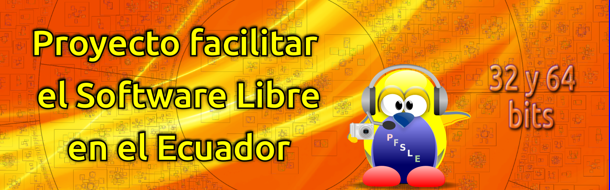

# God Bless You
Welcome to my GitHub account, I hope you like it

Bienvenidos a mi cuenta en GitHub, espero les sea de su agrado

I'm a 32-bit Linux user and one of the important things I'm doing is compiling some applications that are no longer available for 32-bit, plus along the way I've realized I can build and improve some. Also like to document what is serving me

Soy un usuario de Linux de 32 bits y una de las cosas importantes que estoy haciendo es compilar algunas aplicaciones que ya no están disponibles para 32 bits, además de que en ese camino me di cuenta que puedo crear y mejorar algunas. También me gusta documentar aquello que me va sirviendo

# Programs for Linux in 32 and 64 bits
|  Tecnology  |                                      Repository                                      |                                                                                                                                                                                                          Description                                                                                                                                                                                                           |
| ----------- | ------------------------------------------------------------------------------------ | ------------------------------------------------------------------------------------------------------------------------------------------------------------------------------------------------------------------------------------------------------------------------------------------------------------------------------------------------------------------------------------------------------------------------------ |
| Bash        | [adb-send-files](https://github.com/wachin/adb-send-files)                           | Copy/Transfer files from Android phone to a Linux Personal Computer (PC) and from PC to Android phone with adb using scripts running on Clex Linux Terminal File Manager     Copiar/transferir archivos desde un teléfono con Android a una computadora personal (PC) con Linux y desde Linux a un teléfono Android con adb usando scripts que se ejecutan en el administrador de archivos para linea de comandos Clex |
| Bash        | [ffmpeg-screencast](https://github.com/wachin/ffmpeg-screencast)                     | Capture and record your screen with scripts made for ffmpeg with pause option from the Linux Terminal using Clex     Capture y grabe su pantalla con scripts hechos para ffmpeg con opción de pausa desde la Terminal de Linux usando Clex                                                                                                                                                                             |
| C++        | [RisenPC-Fluxbox-ES](https://github.com/wachin/RisenPC-Fluxbox-ES)                   | Customized FluxBox for Computers with low resources, in Spanish     FluxBox personalizado para Ordenadores con pocos recursos, en español                                                                                                                                                                                                                                                                              |
| Java, Shell | [shutter-encoder-Linux](https://github.com/wachin/shutter-encoder-Linux)             | A professional video compression tool accessible to all     Una herramienta de compresión de video profesional accesible para todos                                                                                                                                                                                                                                                                                    |
| C++         | [vnote](https://github.com/wachin/vnote)                                             | A pleasant note-taking platform in Markdown     Una agradable plataforma para tomar notas en Markdown                                                                                                                                                                                                                                                                                                                  |

# Tutorials
|  Tecnology  |                                      Repository                                      |                                                                                                                                                                                                          Description                                                                                                                                                                                                           |
| ----------- | ------------------------------------------------------------------------------------ | ------------------------------------------------------------------------------------------------------------------------------------------------------------------------------------------------------------------------------------------------------------------------------------------------------------------------------------------------------------------------------------------------------------------------------ |
| Text, Markdown    | [Facilitar-el-Software-Libre](https://github.com/wachin/Facilitar-el-Software-Libre) | Writing my tutorials in text with Kate and in Markdown with VNote     Escribiendo mis tutoriales en texto con Kate y en Markdown con VNote                                                                                                                                                                                                                                                                                                         |
| Text   | [Linux-WachiManuales](https://github.com/wachin/Linux-WachiManuales)                 | Linux tutorials     Manuales Linux                                                                                                                                                                                                                                                                                                                                                                                     |

## Social networks: 
- Facebook [wachin.id](https://www.facebook.com/wachin.id)  
- Instagram [washington_indacochea](https://www.instagram.com/washington_indacochea/)  

# Where everything began
The following website is my main blog, there I started to create entries about Linux programs and related topics, in spanish:

**Historia de esta página ~ Proyecto Facilitar el Software Libre en el Ecuador**  
[https://facilitarelsoftwarelibre.blogspot.com/2019/08/historia-de-esta-pagina.html](https://facilitarelsoftwarelibre.blogspot.com/2019/08/historia-de-esta-pagina.html)

Y try to wrote some entries into english in:

**Project Facilitating Free Software in Ecuador**  
[https://facilitatingfreesoftware.blogspot.com/](https://facilitatingfreesoftware.blogspot.com/)

# Mission and Vision
Linux, the final frontier. These are the voyages of Washington Indacochea Delgado aboard the MX Linux Operating System; his continuing mission, to explore new ways to make it easier to use Free Software to it can go to places where he never could.

Linux, la frontera final. Estos son los viajes de Washington Indacochea Delgado a bordo del Sistema Operativo MX Linux; su continua misión, explorar nuevas maneras de facilitar el uso del Software Libre para que llegue a lugares donde nunca pudo llegar.

